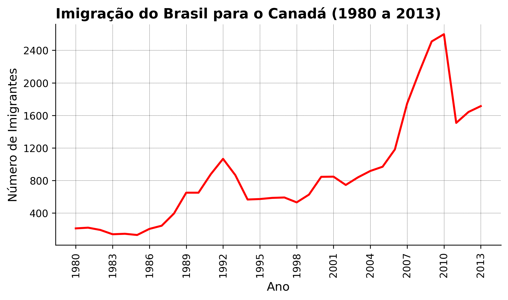
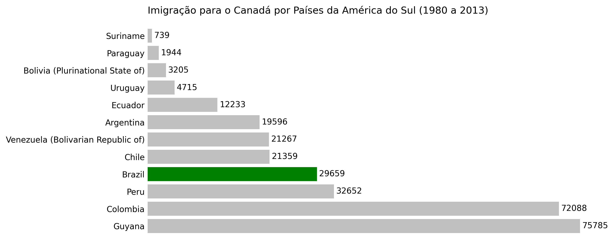

# Data Visualization: criando gráficos com bibliotecas Python

Este repositório faz parte da minha sequência de estudos em Data Science e Data Visualization. Como guia nesta trajetória, o curso [Data Visualization: criando gráficos com bibliotecas Python](https://cursos.alura.com.br/course/data-visualization-graficos-bibliotecas-python) da [Alura](https://www.alura.com.br/) foi tomado como base.

## 1. Conhecendo a biblioteca Matplotlib

No primeiro capítulo foram introduzidos recursos base da biblioteca [Matplotlib](https://matplotlib.org/). Para isso, uma [base de dados](dados/canadian_immegration_data.csv) sobre imigrações para o Canadá foi utilizada.

Clique [aqui](notebooks/01-conhecendo_a_bibliteca_matplotlib.ipynb) para acessar o caderno do capítulo 1.

## 2. Criando figuras com Matplotlib

No segundo capítulo foi introduzido o conceito de subplots, permitindo que mais de um gráfico fosse criado em uma figura.

Clique [aqui](notebooks/02-criando_figuras_com_matplotlib.ipynb) para acessar o caderno do capítulo 2.

## 3. Customizando com Matplotlib

No terceiro capítulo foram abordados conceitos de estilização de gráficos e exportação das figuras para diferentes formatos de arquivos.

Com esses conhecimentos, foram exportados os seguintes gráficos:

Clique [aqui](notebooks/03-customizando-com-matplotlib.ipynb) para acessar o caderno do capítulo 3.

## 4. Conhecendo a biblioteca Seaborn

## 5. Gráficos interativos com Plotly
